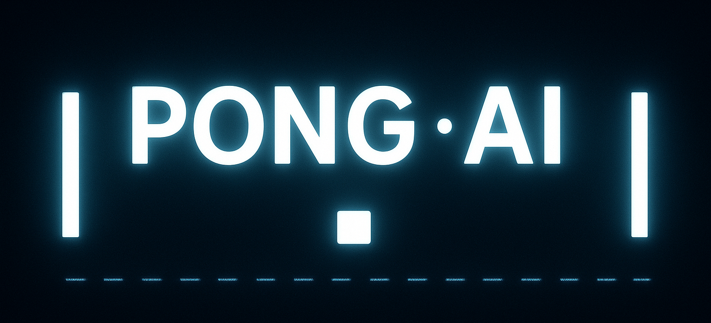
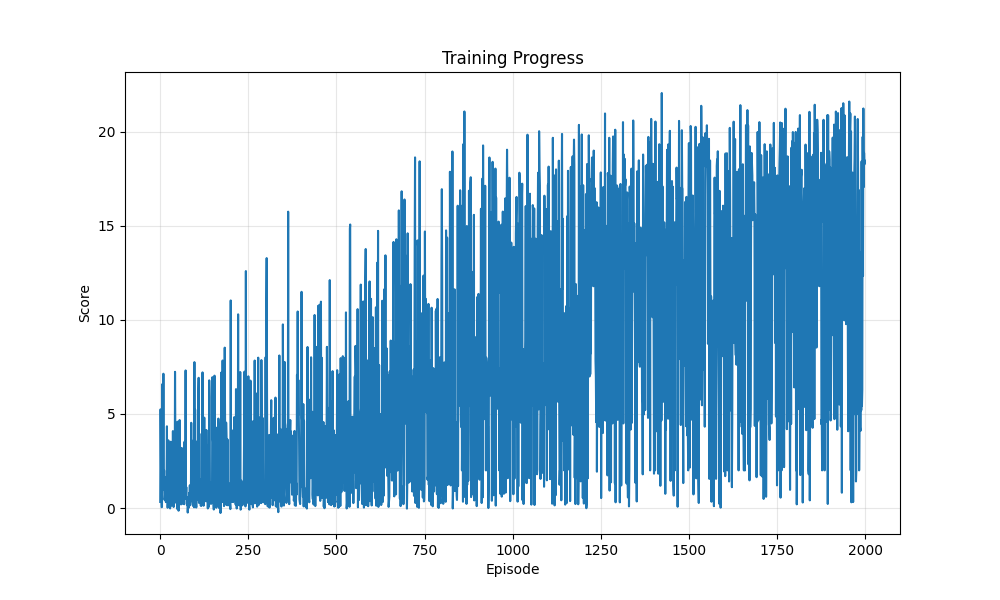

# Pong AI Model Training

<p align="center">
  
</p>

## Overview

This repository contains the machine learning training code used to develop the AI opponent for the SmartPong Flutter application. The model was trained using Deep Q-Networks (DQN) to create a responsive and challenging opponent that can effectively predict ball movement and respond with realistic paddle control.

## Project Structure

This project represents **Phase 1** of the NeonPong AI development:

1. **Phase 1: AI Model Training** (This repository)
   - Training a Deep Q-Network model to play Pong
   - Converting model to TensorFlow Lite format
   - Optimizing for mobile deployment

2. **Phase 2: Flutter App Development**
   - Implementing the game interface
   - Integrating the TFLite model
   - Creating responsive controls and animations

## Technical Implementation

### Model Architecture

The AI opponent uses a **Double Deep Q-Network** with the following features:

- Input layer of 6 normalized game state parameters:
  - Ball position (x, y)
  - Ball velocity (x, y)
  - Paddle positions (left, right)
- Two hidden layers with 128 neurons each and ReLU activation
- Output layer with 3 action values (stay, move up, move down)

### Training Process

The model was trained using:

- **Experience replay** with a buffer size of 50,000 experiences
- **Epsilon-greedy exploration** with annealed exploration rate
- **Double DQN** algorithm to reduce overestimation of Q-values
- **Soft target network updates** to improve training stability
- **Reward shaping** to encourage realistic paddle movement and ball control

Training metrics targeted:
- 90% hit rate success
- Maximum rally length optimization
- Realistic ball physics with proper spin and angle control

## Training Results

After training for approximately 1,500 episodes:

- **Hit Rate:** >90% on evaluation
- **Max Rally Length:** Consistently over 30 volleys
- **Model Size:** ~200KB in TensorFlow Lite format
- **Response Time:** Optimized for real-time gameplay on mobile devices



## Converting Model to TFLite

The trained Keras model is converted to TensorFlow Lite format for mobile deployment using the following process:

```python
import tensorflow as tf

# Load your Keras model
model = tf.keras.models.load_model("pong_best_hitrate.keras")

# Convert to TFLite
converter = tf.lite.TFLiteConverter.from_keras_model(model)
tflite_model = converter.convert()

# Save it
with open("pong_ai_model.tflite", "wb") as f:
    f.write(tflite_model)
```

This creates a highly optimized version of the model that can be easily integrated into the Flutter application.

## Environment Simulation

The training environment simulates the physics of a Pong game with:

- Realistic ball movement and collision physics
- Simulated spin effects based on paddle movement
- Variable ball speed and trajectory angles
- Randomized starting positions and directions

## Requirements

If you want to run the training code yourself:

- Python 3.7+
- TensorFlow 2.4+
- NumPy
- Matplotlib
- (Optional) CUDA-compatible GPU for faster training

## Usage

1. Clone the repository:
   ```
   git clone https://github.com/gauravvjhaa/pong-ai-training.git
   cd pong-ai-training
   ```

2. Install dependencies:
   ```
   pip install -r requirements.txt
   ```

3. Run the training script:
   ```
   python train_pong_ai.py
   ```

4. The training process will output:
   - Trained model files (.keras format)
   - TensorFlow Lite models (.tflite)
   - Training logs and visualizations

## Integration with Flutter App

The `pong_ai_model.tflite` file can be integrated into the Flutter application by:

1. Adding it to the assets directory
2. Using the `tflite_flutter` package to load and execute the model
3. Feeding normalized game state to the model
4. Interpreting the output actions to control the AI paddle

See Phase 2 repository for implementation details [here](https://github.com/gauravvjhaa/SmartPong.git).

## Credits

- **Developer:** Gaurav Jha
- **Date:** 2025-04-27
- **Contact:** gauravkumarjha306@cic.du.ac.in

---

Copyright © 2025 Gaurav Jha
